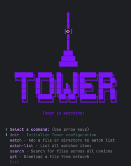

# Tower

**Seamless file sync & discovery across your local network**

[](https://github.com/yourusername/tower)
[](LICENSE)

---

## Overview

Tower is a cross-device file synchronization and discovery tool designed for local networks. It enables fast, privacy-first file sharing across multiple devices without relying on cloud storage. Files stay on their source devices while a lightweight central registry tracks metadata, enabling instant discovery and transfer.

Perfect for:
- Accessing files across your laptop, desktop, and other devices at home
- Sharing large files with teammates on the same network
- Keeping project files synced without cloud dependencies
- Privacy-conscious users who want control over their data


*Tower's interactive command-line interface*

---

## Key Features

- **Automatic File Syncing**: Background processes monitor watched directories and keep metadata up to date
- **Cross-Device Discovery**: Search for files across all connected devices using wildcard patterns (e.g., `*.pdf`, `report_*.docx`)
- **Direct File Transfer**: Download files from any device with a simple command using secure SCP protocol
- **Privacy-First Design**: The backend only stores metadata - your files never leave their source devices
- **Lightweight & Fast**: Optimized for local networks where low latency makes cloud solutions unnecessary
- **Simple CLI Interface**: Intuitive commands for all operations

---

## Quick Start

### Backend (Raspberry Pi / Server)

```bash
# Clone repository
git clone <repository-url>
cd tower/backend

# Install dependencies
pip install -r requirements.txt

# Start server
uvicorn main:app --host 0.0.0.0 --port 8000
```

### CLI (Client Devices)

```bash
# Clone repository
git clone <repository-url>
cd tower/tower_cli

# Install and build
npm install
npm run build

# Link globally (optional)
npm link

# Initialize Tower
tower init
```

---

## Installation

### Prerequisites

**Backend Requirements:**
- Python 3.8+
- pip
- A server on your local network (Raspberry Pi recommended)

**CLI Requirements:**
- Node.js 16+
- npm
- SSH configured (for SCP transfers)
- macOS, Linux, or Windows with WSL

### Detailed Setup

See [SETUP.md](SETUP.md) for complete installation instructions including:
- Backend configuration
- CLI installation
- Network setup and SSH key configuration
- Systemd service setup for auto-start

---

## Usage

### Basic Commands

```bash
# Initialize Tower and configure backend URL
tower init

# Add files/folders to watch list
tower watch add /path/to/documents
tower watch add /path/to/projects -r --exclude node_modules dist .git

# Sync watched files to backend registry
tower sync

# Search for files across all devices
tower search "*.pdf"
tower search "report"

# Download a file from the network
tower get <file-id> -d ~/Downloads/
```

### Example Workflow

```bash
# On Device A (laptop)
tower watch add ~/Projects/myapp -r --tags work
tower sync

# On Device B (desktop)
tower search "myapp"
# Results show file IDs and locations

tower get abc123 -d ~/Projects/
# File transferred directly from Device A to Device B
```

### Available Commands

| Command | Description |
|---------|-------------|
| `tower init` | Configure backend API endpoint |
| `tower watch add <path>` | Add file/folder to watch list |
| `tower watch list` | View all watched files |
| `tower sync` | Sync watched files to backend |
| `tower search <query>` | Search files across devices (supports wildcards) |
| `tower get <file-id>` | Download file from network |

---

## Architecture

Tower uses a three-tier architecture:

```
┌─────────────┐      ┌─────────────┐      ┌─────────────┐
│   Device A  │      │   Backend   │      │   Device B  │
│  (CLI)      │◄────►│  (FastAPI)  │◄────►│  (CLI)      │
│             │      │             │      │             │
│ Files + CLI │      │  Metadata   │      │ Files + CLI │
└─────────────┘      │   Only      │      └─────────────┘
                     └─────────────┘
                            │
                     ┌──────▼──────┐
                     │   SQLite    │
                     │  Database   │
                     └─────────────┘
```

### Components

1. **Tower CLI (TypeScript)**: Client-side application that:
   - Watches local files for changes
   - Registers file metadata with backend
   - Searches for files across the network
   - Handles file transfers via SCP

2. **Backend (FastAPI)**: Central coordinator that:
   - Maintains SQLite database of file metadata
   - Provides REST API for file discovery
   - Coordinates SCP transfers between devices
   - Never stores actual files

3. **SQLite Database**: Stores:
   - File metadata (name, path, size, modified time)
   - Device information (IP, hostname, user)
   - File locations for cross-device lookups

### File Transfer Flow

Tower uses a **2-hop SCP transfer mechanism**:

```
Source Device → Backend (temporary) → Destination Device
```

This ensures:
- Backend never permanently stores files
- Transfers are secure (SSH/SCP)
- Network bandwidth is optimized
- Privacy is maintained

---

## Technology Stack

- **CLI**: TypeScript, Node.js, Commander.js, Inquirer
- **Backend**: Python, FastAPI, SQLAlchemy, SQLModel
- **Database**: SQLite
- **File Transfer**: SCP (Secure Copy Protocol)
- **Network**: REST API over local network
- **Other**: SSH key management, file system monitoring

---

## Development

### Running in Development Mode

**Backend with auto-reload:**
```bash
cd backend
uvicorn main:app --reload --host 0.0.0.0 --port 8000
```

**CLI with watch mode:**
```bash
cd tower_cli
npm run dev
```

In another terminal:
```bash
node dist/index.js <command>
```

### Project Structure

```
tower/
├── backend/              # FastAPI backend service
│   ├── main.py          # API endpoints
│   ├── models.py        # Database models
│   ├── requirements.txt # Python dependencies
│   └── file_sync.db     # SQLite database (created at runtime)
│
├── tower_cli/           # TypeScript CLI application
│   ├── src/            # Source files
│   ├── dist/           # Compiled JavaScript
│   ├── package.json    # Node dependencies
│   └── tsconfig.json   # TypeScript config
│
├── test_files/         # Test files for development
└── README.md           # This file
```

### Database Management

Access the SQLite database:

```bash
cd backend
sqlite3 file_sync.db

# View all registered files
SELECT * FROM filerecord;

# Search for files
SELECT * FROM filerecord WHERE file_name LIKE '%report%';

# Count files per device
SELECT device, COUNT(*) FROM filerecord GROUP BY device;
```

---

## Configuration

### Environment Variables

Create a `.env` file in the project root:

```bash
TOWER_BACKEND_URL="http://192.168.1.100:8000"
```

### Configuration File

Tower creates `~/.tower/config.json` with default settings:

```json
{
  "autoSync": true,
  "syncInterval": 5,
  "conflictResolution": "latest",
  "excludePatterns": ["node_modules", ".git", "*.log", ".DS_Store"],
  "devices": [],
  "watchList": []
}
```

---

## API Reference

### Endpoints

#### Search Files
```bash
GET /files/search?query=<pattern>
```

#### Get File Metadata
```bash
GET /files/{file_id}
```

#### Register File
```bash
POST /files/register
Content-Type: application/json

{
  "file_name": "document.pdf",
  "absolute_path": "/home/user/docs/document.pdf",
  "device": "laptop",
  "device_ip": "192.168.1.101",
  "device_user": "john",
  "last_modified_time": "2025-10-19T10:00:00",
  "size": 1024000,
  "file_type": ".pdf"
}
```

#### Delete File Metadata
```bash
DELETE /files/{file_id}
```

See [SETUP.md](SETUP.md) for detailed API documentation.

---

## Roadmap

- [ ] Enhanced natural language search using LLM-based file content analysis
- [ ] GUI desktop application with drag-and-drop functionality
- [ ] Mobile apps (iOS/Android) for on-the-go access
- [ ] Smart sync with selective rules and bandwidth throttling
- [ ] Zero-config networking using mDNS/Bonjour
- [ ] Conflict resolution for simultaneous file modifications
- [ ] End-to-end encryption for sensitive files
- [ ] Multi-user support with permission management

---

## Security Considerations

1. **Local Network Only**: Tower is designed for trusted local networks. Do not expose the backend to the internet without proper authentication.

2. **SSH Security**:
   - Use SSH keys for passwordless authentication
   - Consider key passphrases for sensitive environments
   - Restrict SSH access with firewalls

3. **File Permissions**: Ensure watched files have appropriate permissions on source devices.

4. **No Authentication**: Current version assumes a trusted network. Production use should implement authentication.

---

## Troubleshooting

### Backend Not Accessible

```bash
# Check backend status
sudo systemctl status tower-backend

# Test connectivity
curl http://<backend-ip>:8000/

# Check firewall
sudo ufw allow 8000/tcp
```

### SCP Transfer Fails

```bash
# Test SSH connection
ssh username@target-device-ip

# Copy SSH keys
ssh-copy-id username@target-device-ip
```

See [SETUP.md](SETUP.md) for complete troubleshooting guide.

---

## Contributing

We welcome contributions! To contribute:

1. Fork the repository
2. Create a feature branch (`git checkout -b feature/amazing-feature`)
3. Commit your changes (`git commit -m 'Add amazing feature'`)
4. Push to the branch (`git push origin feature/amazing-feature`)
5. Open a Pull Request

---

## License

This project is licensed under the MIT License - see the [LICENSE](LICENSE) file for details.

---

## Acknowledgments

Built with passion during a hackathon. Special thanks to the open-source community for the amazing tools that made this possible.

---

## Support

- **Issues**: [GitHub Issues](<repository-url>/issues)
- **Documentation**: [SETUP.md](SETUP.md)

---

**Happy syncing!**